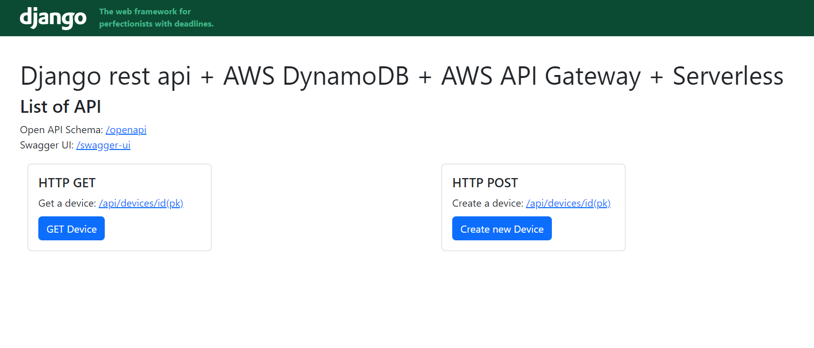
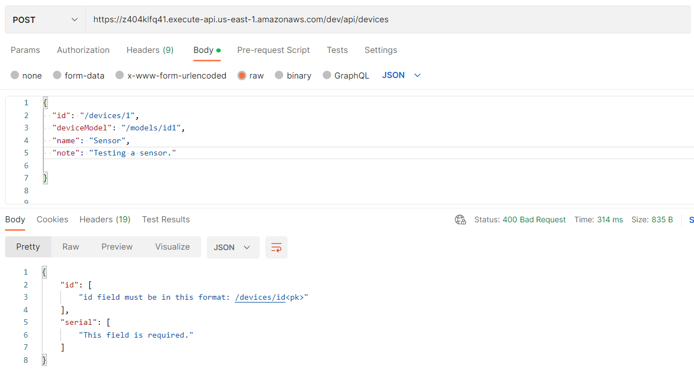
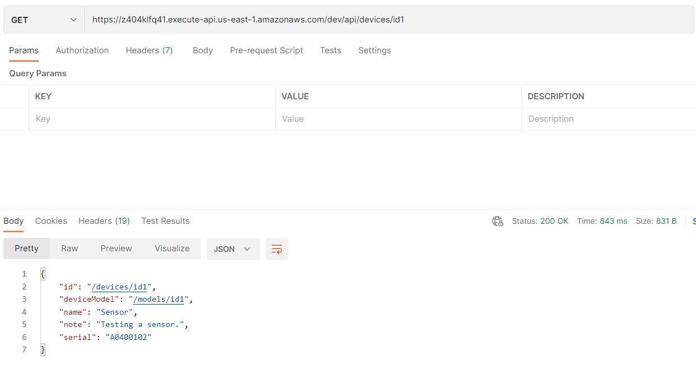

# Django Restful API Challenge

Implement a simple Restful API on Django using the following tech stack: Python, Django Rest Framework, AWS DynamoDB


## Getting Started
- [How to run this project?](#how-to-run-this-project)
- [Results and Test Cases](#results-and-tests)
- [Deploy on AWS Lambda func by zappa](#deploy-on-aws-lambda)


# How to run this project

### 1. Clone repository:
```bash
>>> git clone https://github.com/M-Taghizadeh/Django-Restful-API-Challenge.git
>>> cd Django-Restful-API-Challenge
```

### 2. install requerments.txt
 
- install python 3.10.3 from [here](https://www.python.org/downloads/release/python-3103/)

```bash
>>> python -m venv venv
>>> venv\Scripts\activate
```


```bash
>>> cd .\config\
>>> pip install -r requirements.txt
```

### 3. Setup AWS CLI Configuration
- Download AWS CLI from [here](https://docs.aws.amazon.com/cli/latest/userguide/getting-started-install.html) and install it.

- on aws cli terminal:

```bash
>>> aws configure --profile dev
```

- Enter your IAM information (Access Key, Secret Key, Region) in profile [dev] from **~/.aws/credentials** file:

```bash

```bash
$ AWS Access Key ID [None]: ENTER YOUR ACCESSKEY
$ AWS Secret Access Key [None]: ENTER YOUR SECRETKEY
$ Default region name [None]: ENTER YOUR REGION (us-east-1)
$ Default output format [None]: json
```

### 4. AWS DynamoDB

**You can Skip this section if the table already exists in dynamoDB**

After entering the AWS Secret variables, we can use dynamodb migration to create our nosql database.

```bash 
>>> python aws_dynamodb_migration.py
```

After this, on AWS Dynamodb, we will see our database with the name "devices", you can check it on [here](https://us-east-1.console.aws.amazon.com/dynamodbv2/home?region=us-east-1#tables).
In the terminal, you can see the message.
```bash 
Table was created successfully. Table size: 0
```

To see "devices" table in the list of tables, you can run this command
```bash
>>> aws dynamodb list-tables
```

** NOTE: You can check the table on AWS DynamoDB console.**


- Select the "devices" table and click button "Explore table items"


- You can see the table items (assume that we have item "devices/id1" in the table)


### 5. Rename .env.template to .env and update MY_AWS_SECRET_ACCESS_KEY, MY_AWS_ACCESS_KEY_ID and MY_AWS_DEFAULT_REGION in .env file

```bash
MY_AWS_SECRET_ACCESS_KEY=
MY_AWS_ACCESS_KEY_ID=
MY_AWS_DEFAULT_REGION=
```

```python

### 6. Run server and use it in your local
```bash
>>> cd .\djangoProject
>>> python .\manage.py runserver
```


# Results and Tests

### AWS API Gateway URL
https://z404klfq41.execute-api.us-east-1.amazonaws.com/dev



### Swagger UI URL
https://z404klfq41.execute-api.us-east-1.amazonaws.com/dev/swagger-ui/


## Results

### Request 1 : Create New Device

**POST**: https://z404klfq41.execute-api.us-east-1.amazonaws.com/dev/api/devices/

```python
Body (application/json):
{
  "id": "/devices/id1",
  "deviceModel": "/models/id1",
  "name": "Sensor",
  "note": "Testing a sensor.",
  "serial": "A0400102"
}
```

### Response 1 - Success:
- **HTTP 201** Created


### Response 1 - Failure 1:
- **HTTP 400** Bad Request

If any of the payload fields are missing. Response body should have a descriptive error message for the client to be able to detect the problem.



### Response 1 - Failure 2:
- **HTTP 409** Conflict Error

If Item was already exists with this id.


<hr>

### Request 2 : Get Device 

**POST**: https://z404klfq41.execute-api.us-east-1.amazonaws.com/dev/api/devices/id1


### Response 2 - Success:
- **HTTP 200** OK



### Response 2 - Failure 1:
- **HTTP 404** Not Found

If the request id does not exist.


<hr>

## Testing


- Tests Directory

```bash
.\device_service\tests.py
```

You can see 6 test cases in this file.

- **test1_get_device_valid()**: test API get device with valid id (return **200**)
- **test2_get_device_invalid()**: test API get device with invalid id (return **404**)
- **test1_create_device_return_success()**: test API create device with valid payload (return **201**)
- **test2_create_device_missing_field()**: test API create device with invalid payload (missing fields) (return **400**)
- **test3_create_device_invalid_id()**: test API create device with invalid payload (invalid id) (return **400**)
- **test4_create_device_duplicate_item()**: test API create device with invalid payload (already exists) (return **409**)


- run the tests

```bash
>>> python .\manage.py test   
```

- Tests Outputs

```bash
Found 6 test(s).
System check identified no issues (0 silenced).
...<Response status_code=409, "application/json">
...
----------------------------------------------------------------------
Ran 6 tests in 2.847s

OK
```

<hr>

# Deploy on AWS lambda

### Zappa - Serverless Python
Zappa makes it super easy to build and deploy server-less, event-driven Python applications (including, but not limited to, WSGI web apps) on AWS Lambda + API Gateway. Think of it as "serverless" web hosting for your Python apps. That means infinite scaling, zero downtime, zero maintenance - and at a fraction of the cost of your current deployments!

- https://github.com/zappa/Zappa

We can deploy our python project on lambda and S3 buckets using zappa in the following three steps

```bash
$ pip install zappa
$ zappa init

```

This will automatically detect your application type (Flask/Django - Pyramid users see here) and help you define your deployment configuration settings. Once you finish initialization, you'll have a file named **zappa_settings.json** in your project directory defining your basic deployment settings. It will probably look something like this for most WSGI apps:

    {
        "dev": {
            "aws_region": "us-east-1",
            "django_settings": "djangoProject.settings",
            "profile_name": "dev",
            "project_name": "djangoproject",
            "runtime": "python3.9",
            "s3_bucket": "zappa-6wtu4g1xv"
        },
    }
    
#### Deploying to AWS Lambda

```bash
$ zappa deploy dev
```

After the deployment, we can see the following output in the terminal.

```bash
Waiting for lambda function [djangoproject-dev] to be updated...
Your updated Zappa deployment is live!: https://z404klfq41.execute-api.us-east-1.amazonaws.com/dev
```

If you need to update your project and re-deploy, you can use the following command.

```bash
$ zappa update dev
```

To undeploy your project, you can use the following command.

```bash
$ zappa undeploy dev
```


